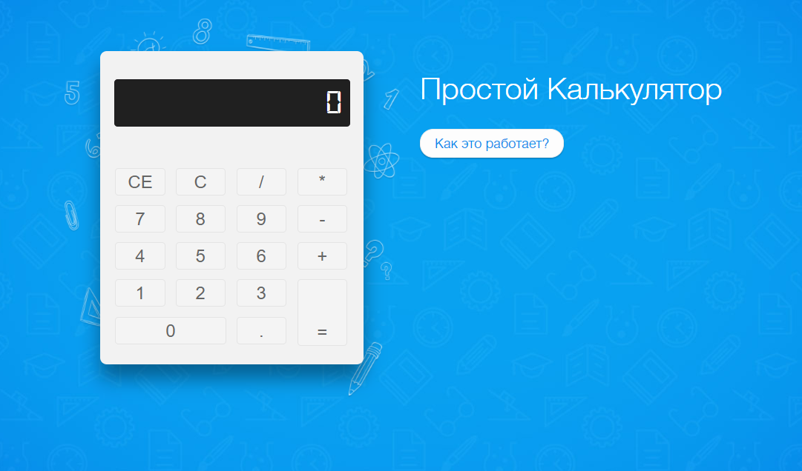

# Calculator

Калькулятор сверстан в рамках урока "Основы программирования" в LoftSchool.

***Цель***: Изучить основы **JavaScript**.

## Посмотреть по ссылке: [Calc](https://alkhimovmv.github.io/Calc/)

